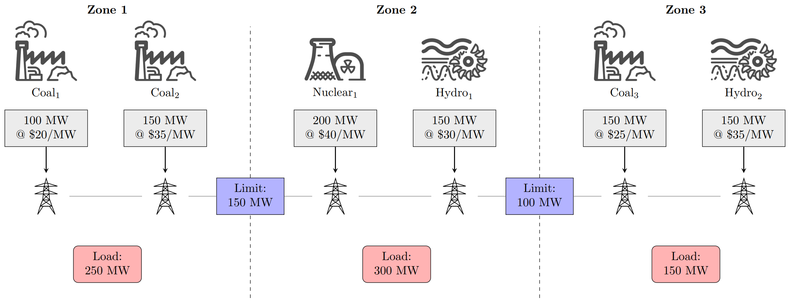

# Location-Based Marginal Pricing using Gurobi

This repository contains a small-scale cost optimization problem
to fulfill energy demands. The problem is subject to generator supply and
transmission bus limits. A final price is calculated after Gurobi
locates an optimal solution to determine the marginal price and
congestion costs for each load zone.

## Features
- Linear optimization model in Python / Gurobi
- Decision variable: generator → load delivery \(x_{g,l}\)
- Transmission cut constraints
- Marginal price extraction
- Congestion identification
- Example results included

## Repository Structure
```
.
├── code\
│   ├── main.ipynb
│   └── util.py
├── images\
│   ├── LBMP_Complete.png
│   └── LBMP_Start.png
├── presentation\
│   └── LBMP_Example.pdf
├── README.md
├── requirements.txt
└── LICENSE
```
## Model Summary

The model minimizes total cost of generation while satisfying:
- Load demand must be fully met
- Generator outputs must not exceed capacity
- Transmission cut constraints ensure total flow across a zonal
  interface does not exceed transfer capability

The main decision variable is:
- \(x_{g,l}\): power sent from generator \(g\) to load \(l\)

After solving, marginal prices are computed and transmission bus
congestion is identified by comparing transmission flows against 
interface capacity.

## Example Problem

The following image represents the problem environment that will be
optimized in the example code. 



## Requirements

- Python 3.13+
- Gurobi 12 (with valid license)

Install dependencies:
```bash
pip install -r requirements.txt
